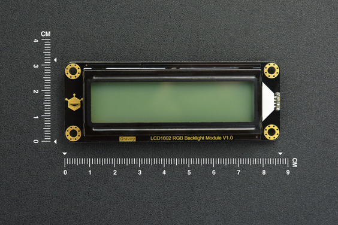
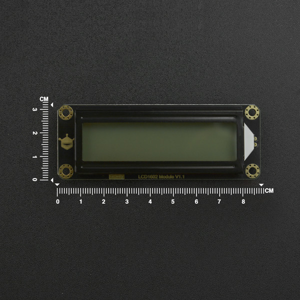

# DFRobot_RGBLCD1602

- [中文版](./README_CN.md)

Have you been fed up with Black/White LCD screen? Do you want to try a colorful one? DFRobot I2C 16x2 Arduino LCD with RGB Backlight Display module will bring you a new experience about screen. It comes with RGB full color backlight, which has 16 million kinds of color. This I2C 16x2 LCD Screen is using an Gravity I2C communication interface. It means it only needs 2 communication lines for the communication and backlight control. The LCD can display 2x16 characters and support scrolling-displaying and cursor movement. Without tedious wiring and complicated codes, you can just utilize the specific Arduino library to accomplish all the design.





## Product Link(https://www.dfrobot.com/product-1609.html)

    SKU：DFR0464

## Table of Contents

* [Summary](#summary)
* [Installation](#installation)
* [Methods](#methods)
* [Compatibility](#compatibility)
* [History](#history)
* [Credits](#credits)

## Summary

DFRobot Gravity I2C LCD1602 with RGB Backlight Display can display 2x16 characters and support functions like scrolling-displaying, cursor movement and backlight color adjustment

## Installation

There are two ways to use this library:

1. Open Arduino IDE, find Tools in the status bar -> Manager Libraries, search "DFRobot_RGBLCD1602" and install this library
2. First download the library file, paste it into the \Arduino\Libraries directory, then open the examples folder and run the demo in that folder

## Methods

```C++
  /**
   *  @brief initialize the LCD and master IIC
   */ 
  void init();

  /**
   *  @brief clear the display and return the cursor to the initial position (position 0)
   */
  void clear();

  /**
   *  @brief return the cursor to the initial position (0,0)
   */
  void home();

    /**
     *  @brief Turn off the display
     */
  void noDisplay();

  /**
   *  @brief Turn on the display
   */
  void display();

  /**
   *  @brief Turn  off the blinking showCursor
   */
  void stopBlink();

  /**
   *  @brief Turn on  the blinking showCursor
   */
  void blink();

  /**
   *  @brief Turn off the underline showCursor 
   */
  void noCursor();

  /**
   *  @brief Turn on the underline showCursor 
   */
  void cursor();

  /**
   *  @brief scroll left to display
   */
  void scrollDisplayLeft();

  /**
   *  @brief scroll right to display
   */
  void scrollDisplayRight();
 
  /**
   *  @brief This is for text that flows Left to Right
   */
  void leftToRight();
 
  /**
   *  @brief This is for text that flows Right to Left
   */
  void rightToLeft();

  /**
   *  @brief This will 'left justify' text from the showCursor
   */
  void noAutoscroll();
 
  /**
   *  @brief This will 'right justify' text from the showCursor
   */
  void autoscroll();
   
  /**
   *  @brief Allows us to fill the first 8 CGRAM locations with custom characters
   *  @param location substitute character range（0-7）
   *  @param charmap  character array the size is 8 bytes
   */
  void customSymbol(uint8_t location, uint8_t charmap[]);

  /**
   *  @brief set cursor position
   *  @param col columns optional range 0-15
   *  @param row rows optional range 0-1，0 is the first row, 1 is the second row
   */
  void setCursor(uint8_t col, uint8_t row);
  
  /**
   *  @brief set RGB
   *  @param r  red   range(0-255)
   *  @param g  green range(0-255)
   *  @param b  blue  range(0-255)
   */
  void setRGB(uint8_t r, uint8_t g, uint8_t b);

  /**
   *  @brief set backlight PWM output
   *  @param color  backlight color  Preferences：REG_RED\REG_GREEN\REG_BLUE
   *  @param pwm  color intensity   range(0-255)
   */
  void setPWM(uint8_t color, uint8_t pwm);

  /**
   *  @brief backlight color
   *  @param color  backlight color  Preferences： WHITE\RED\GREEN\BLUE
   */
  void setColor(uint8_t color);

  /**
   *  @brief close backlight
   */
  void closeBacklight();

  /**
   *  @brief set color to white
   */
  void setColorWhite();

  /**
   *  @brief write character
   *  @param data the written data
   */
  virtual size_t write(uint8_t data);

  /**
   *  @brief send command
   *  @param data the sent command 
   */
  void command(uint8_t data);

  /**
   *  @brief set backlight
   *  @param mode  true indicates the backlight is turned on and set to white，false indicates the backlight is turned off
   */
  void setBacklight(bool mode);
```

## Compatibility

| Board         | Work Well | Work Wrong | Untested | Remarks |
| ------------- | :-------: | :--------: | :------: | ------- |
| Arduino uno   |     √     |            |          |         |
| Mega2560      |     √     |            |          |         |
| Leonardo      |     √     |            |          |         |
| ESP32         |     √     |            |          |         |
| micro:bit     |     √     |            |          |         |
| FireBeetle M0 |     √     |            |          |         |


## History

- Date 2021-9-26
- Version V1.0.0


## Credits

Written by yangfeng(feng.yang@dfrobot.com), 2021. (Welcome to our [website](https://www.dfrobot.com/))
 